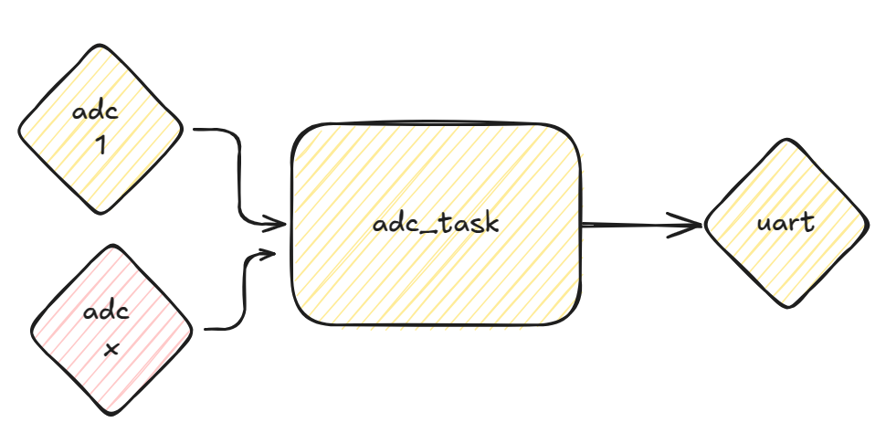

# exe 1



- Arquivo: `exe1/main.c`
- Teste: Verifica printf

> Objetivo: Configurar mais um ADC

O código fornecido configura o ADC 1 (`GP27`) para fazer a leitura do valor do potenciometro conectado nele. Configure o pino ADC 0 (`GP26`) para fazer a leitura do outro potenciometro. 

Valor esperado na serial:

```
voltage 1: 1.650806 V
voltage 2: 2.650806 V
voltage 1: 1.520806 V
voltage 2: 2.120806 V
```

> Dicas:

Você vai precisar consultar o diagrama com o [MUX do ADC](/site/rp2040/imgs/adc.png) para saber o ID que deve usar

