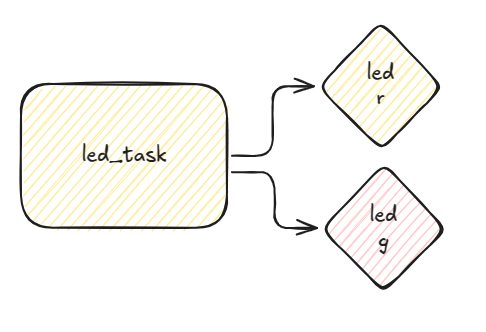

# exe 2

- Arquivo: `exe2/main.c`
- Teste: Verifica pinos dos leds

O exemplo fornecido configura o PWM no pino do LED R para operar em 80% de duty cycle, configure o pino do LED G para operar com 20% de Duty Cycle.

**A diferença na intensidade do LED não é vísivel no wokwi, mas vai ser no mundo real!**

