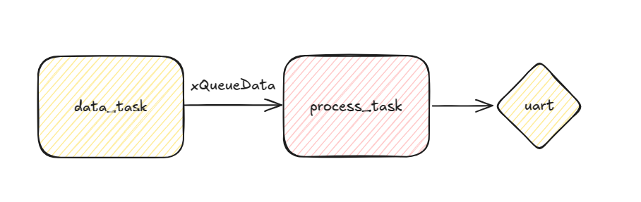
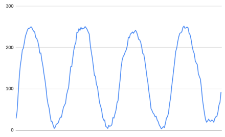

# exe 3



- Arquivo: `exe3/main.c`
- Teste: O valor que aparece no terminal.

O mundo analógico não é brincadeira, um valor pode ter muito ruído devido a diversos fatores. Uma forma fácil de filtrar um ruído que possui frequência maior que a do sinal é por meio de um filtro passa-baixas (lembram de camada?).

A média móvel é um filtro passa-baixas simples de implementar. A ideia é fazer uma média dos valores de entrada para minimizar informações de alta frequência, que podem ser ruído. A média móvel é definida pelo tamanho da janela que aplicamos ao filtro, ou seja, uma média móvel de janela 5 funciona da seguinte maneira: Considere A como o valor de entrada e gere uma saída y:

- `A[5]`: Indica a quinta amostra, `A[4]` a quarta amostra...

$y = \frac{A_{5} + A_{4} + A_{3} + A_{2} + A_{1}}{5}$

Agora, considere a próxima amostra: `A[6]`. A nova saída é o vetor rotacionado (descarta-se a amostra mais antiga) e o novo valor é adicionado ao vetor:

$y = \frac{\boldsymbol{A_{6}} + A_{5} + A_{4} + A_{3} + A_{2}}{5}$

> Dá para implementar a média móvel de duas maneiras: com um vetor ou de forma recursiva.

- Livro com ótima explicação: [The Scientist and Engineer's Guide to Digital Signal Processing](https://www.analog.com/media/en/technical-documentation/dsp-book/dsp_book_ch15.pdf)


## Tarefa
    
Para todos os dados que chegam na fila `xQueueData`, aplique uma média móvel de tamanho 5 e imprima o dado filtrado na UART. 

O dado que chega na fila é um inteiro que representa uma senoide com ruído:


E, aplicando a média móvel, vocês devem obter algo assim:



Sendo o dado esperado na saída da UART para validar o processamento é:

```
28 
47 
89 
127 
155 
172 
193  
```

**Você pode pegar esses dados e plotar no Google Sheets para ver se o resultado é o esperado.**
