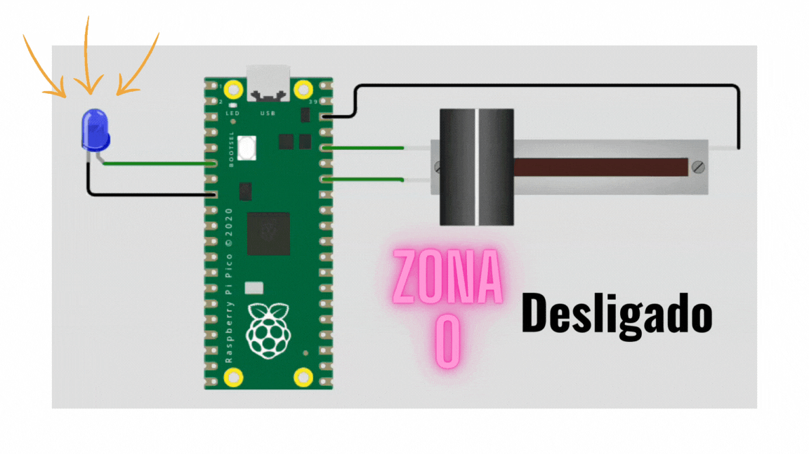
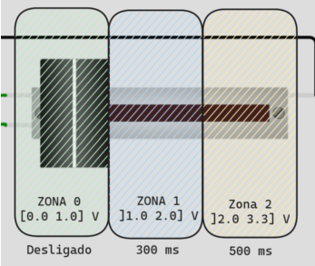

# EXE4

> Questão de prova!

Neste exercício, vocês utilizarão o periférico de **timer** para piscar o LED. O período na qual o LED pisca será definido por uma valor lido do **ADC** no potênciometro seguindo as zonas a seguir:

- 0.0V até 1.0V: Desligado
- 1.0V até 2.0V: 300 ms
- 2.0V até 3.3V: 500 ms

**Detalhes de funcionalidade:**

- Ler o ADC e verificar a zona
- Manter o LED piscando com o período definido pela zona
- O LED deve apagar sempre que estiver na zona 0

**Detalhes do firmware:**

- Baremetal (sem RTOS).
- Deve trabalhar com **TIMER e ADC**.
- Deve trabalhar com interrupções nos botões.  
- Não é permitido usar `sleep_ms(), sleep_us()`.
- **printf** pode atrapalhar o tempo de simulação, comenta/remova antes de testar.
